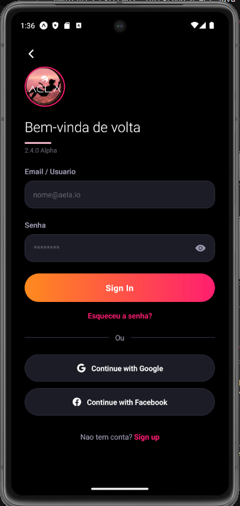
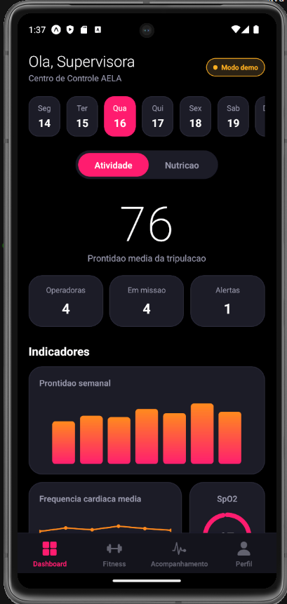
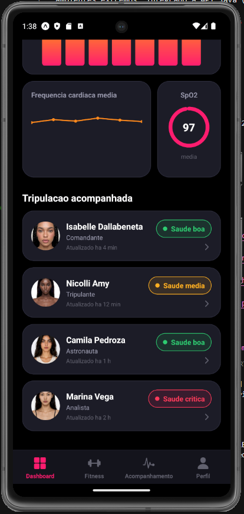
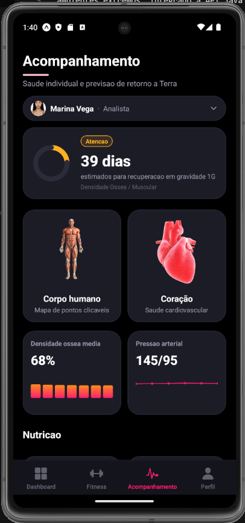
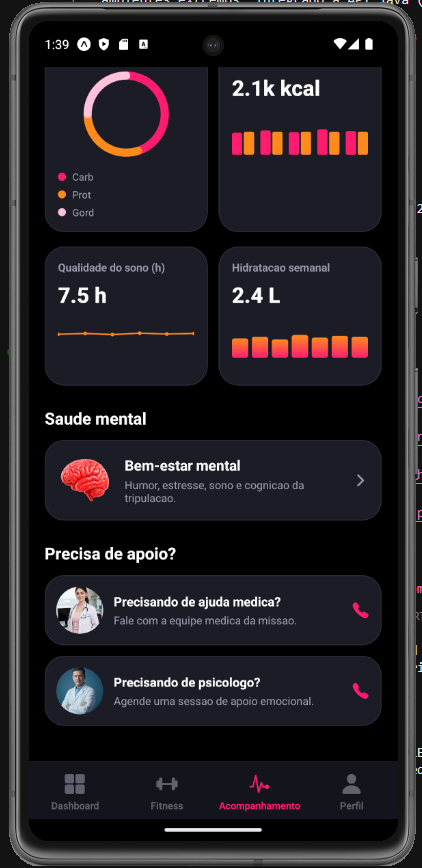
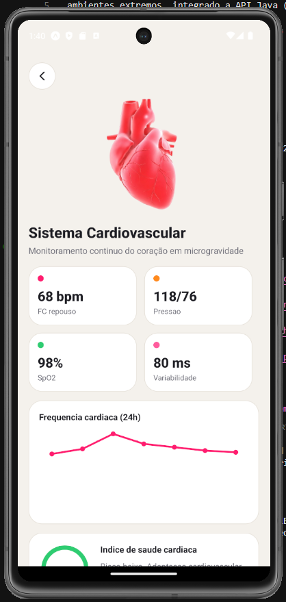
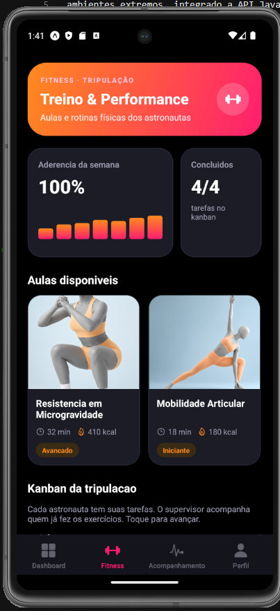
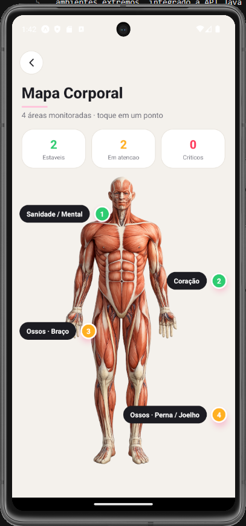

# AELA — Adaptive Exposome Life Assessment
### FIAP Global Solution 2025 — Space Connect

App mobile (React Native + Expo) para acompanhamento biologico de tripulacoes em
ambientes extremos, integrado a API Java (Spring Boot). O sistema compara o operador
**com ele mesmo** (baseline) e preve como sera a saude dele ao voltar a Terra.

---

## Integrantes

| Nome | RM |
|------|----|
| Isabelle Dallabeneta Carlesso | RM554592 |
| Nicolli Amy Kassa | RM559104 |
| Camila Pedroza da Cunha | RM558768 |

---

## Screenshots

<table>
  <tr>
    <td align="center"><br/>Welcome</td>
    <td align="center"><br/>Sign In</td>
    <td align="center"><br/>Dashboard</td>
    <td align="center"><br/>Tripulação</td>
  </tr>
  <tr>
    <td align="center"><br/>Acompanhamento</td>
    <td align="center"><br/>Nutrição</td>
    <td align="center"><br/>Coracão Detalhes</td>
    <td align="center"><br/>Fitness</td>
  </tr>
  <tr>
    <td align="center"><br/>Mapa Corporal</td>
  </tr>
</table>


---

## Como rodar

### 1. Instalar dependencias

```bash
cd AELA_MOBILE
npm install
```

### 2. Rodar no Android

```bash
npx expo start --android
```

Ou escaneie o QR Code com o app **Expo Go** (disponivel na Play Store):

```bash
npx expo start
```

> Use Node.js 18 ou 20 (LTS). Se precisar trocar de versao: `nvm use 20`

---

## Estrutura

```
AELA_GS_4/
├── AELA_MOBILE/      # App React Native + Expo
│   ├── src/
│   │   ├── screens/      # Telas do app
│   │   ├── components/   # Componentes reutilizaveis (Charts, Button...)
│   │   ├── services/     # Modelo preditivo (prediction.js)
│   │   ├── data/         # Dados mock e imagens
│   │   └── theme/        # Cores e estilos globais
│   └── assets/
└── AELA_API_JAVA/    # API Java Spring Boot (Oracle)
```

---

## Telas

1. **Welcome** — logo, Sign In / Create Account
2. **Sign In / Sign Up** — autenticacao com validacoes
3. **Dashboard** — prontidao media da tripulacao, graficos e lista de status
4. **Fitness** — aulas em carrossel e Kanban de tarefas da tripulacao
5. **Acompanhamento** — seletor de astronauta, previsao de recuperacao individual, corpo humano, coracao e saude mental
6. **Mapa Corporal** — pontos interativos: mental, coracao, ossos (braco e perna)
7. **System Detail** — curva de recuperacao projetada por sistema (on-device)
8. **Perfil** — dados do operador e leitura por camera

---

## Modelo preditivo (ML)

`src/services/prediction.js` implementa projecao linear de recuperacao por sistema
(coracao, ossos, mental, ocular) comparando as metricas atuais com o baseline individual.

```python
# Equivalente Python/scikit-learn:
from sklearn.linear_model import LinearRegression
# X = dias em 1G ; y = desvio % do baseline
# modelo prediz dias ate desvio < 5% por sistema
```

---

## API (opcional)

O app funciona em **modo demo** com dados simulados quando a API esta offline.
Para conectar a API Java, edite `app.json` → `extra.apiBaseUrl` com o IP da maquina
e rode:

```bash
cd AELA_API_JAVA
mvn spring-boot:run
```

Configure o Oracle em `src/main/resources/application.properties`.

---

## Requisitos atendidos

- **Interface mobile** — multiplas telas organizadas e responsivas
- **Navegacao** — Stack + Bottom Tabs (React Navigation)
- **Dados** — Estado local, AsyncStorage (kanban/sessao) e API Java externa
- **Recurso mobile** — Camera (expo-image-picker) e Notificacoes locais (expo-notifications)
- **Tratamento de erros** — validacao de formularios, permissoes, fallback offline
